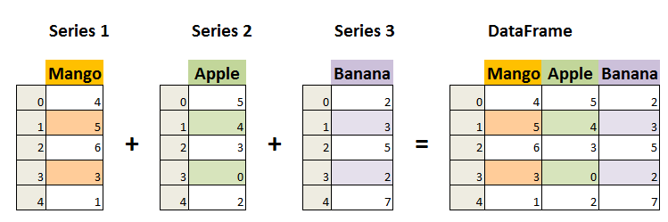
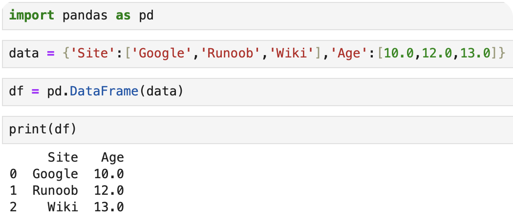
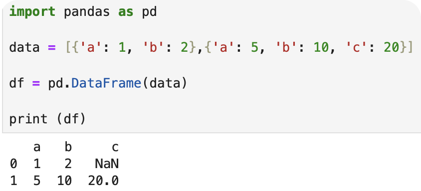

# 使用列表方式创建
import pandas as pd
data = [['google': 10],['runood': 12],['wiki': 13]]
df = pd.DataFrame(data, colums = ['site','age'])
df['site'] = df['site'].astype(str)
df['age'] = df['age'].astype(float)
print(df) 

# 使用字典创建
import pandas as pd

data = {'Site':['Google', 'Runoob', 'Wiki'], 'Age':[10, 12, 13]}

df = pd.DataFrame(data)

print (df)

